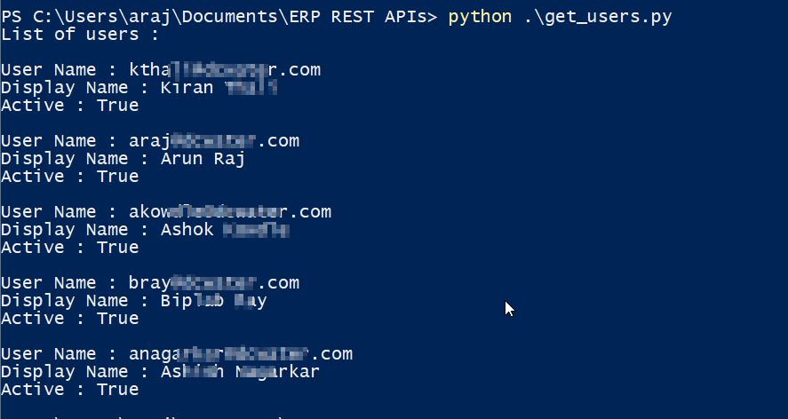

# Oracle Cloud Users REST APIs
  - Check out the REST APIs available for Oracle ERP Cloud [here](https://docs.oracle.com/en/cloud/saas/applications-common/19d/farca/api-users.html)

## Pre Requisites
  - Python 3 (the code was tested on Python 3.8.0)
  - Access to Oracle Cloud ERP (Security Console)
  - requests Python package

## Python Files
  - **create_users.py** : Used to create a user (no role assignment)
  - **update_user.py** : Updates details of an existing user
  - **delete_user.py** : Deletes the user
  - **get_users.py** : Get the list of users and display information  
  
  
## How to Execute
  - python create_users.py
  - python get_users.py
  - python update_user.py
  - python delete_user.py
  
## License
Feel free to use the code for your own projects

## Contributions
  - If you can help me modify the create_users.py file to include role assignment that will be great
